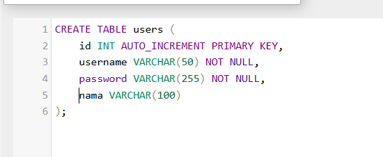
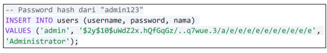
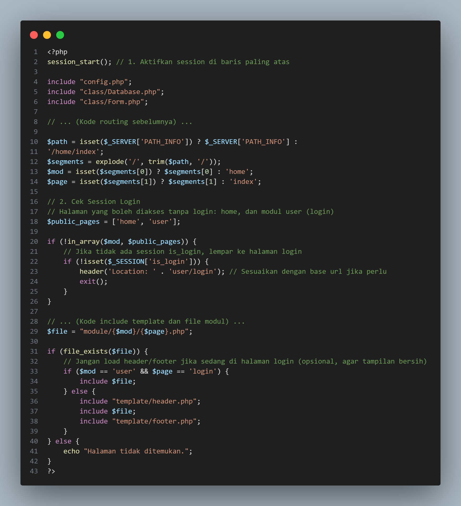
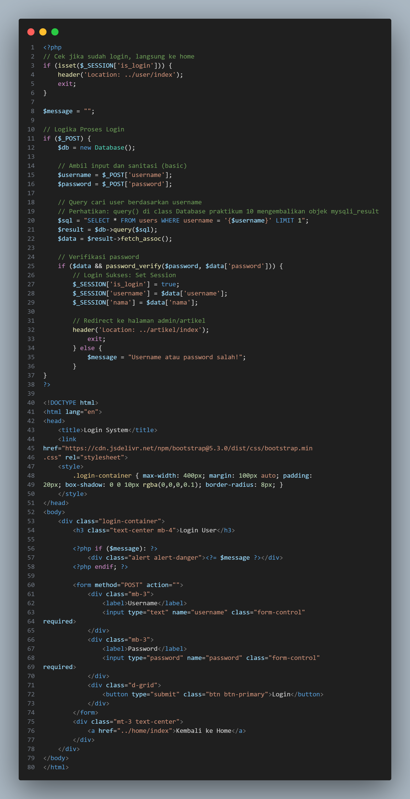
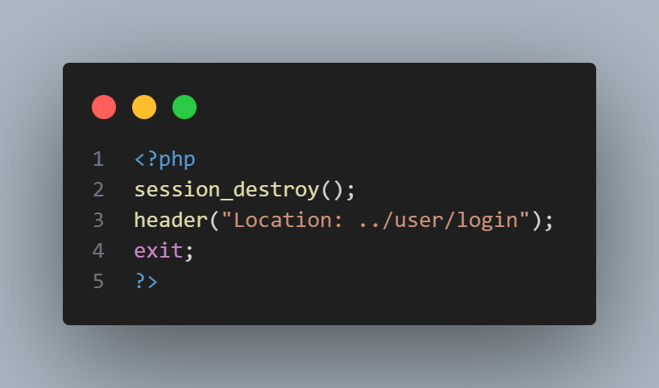
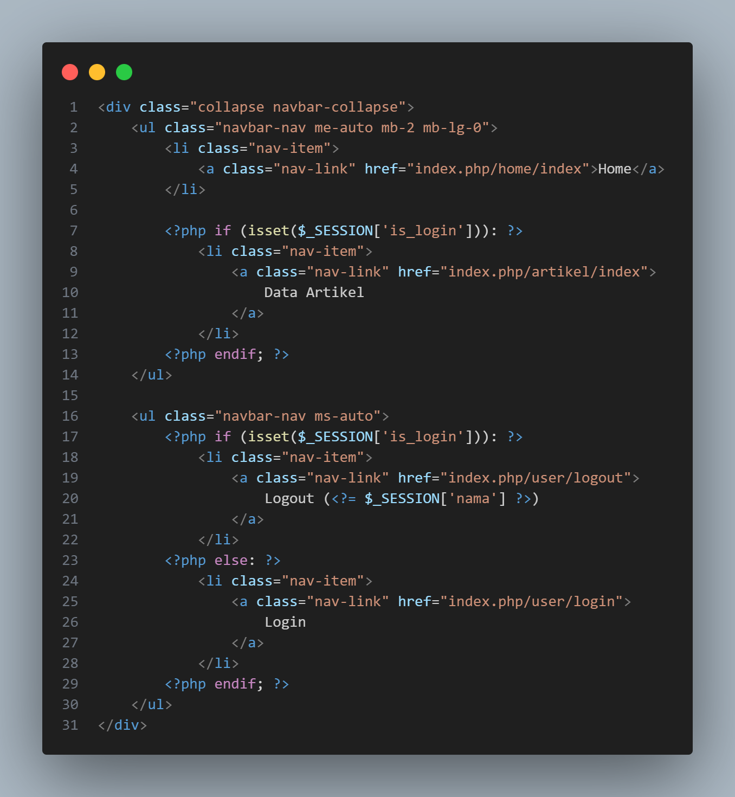
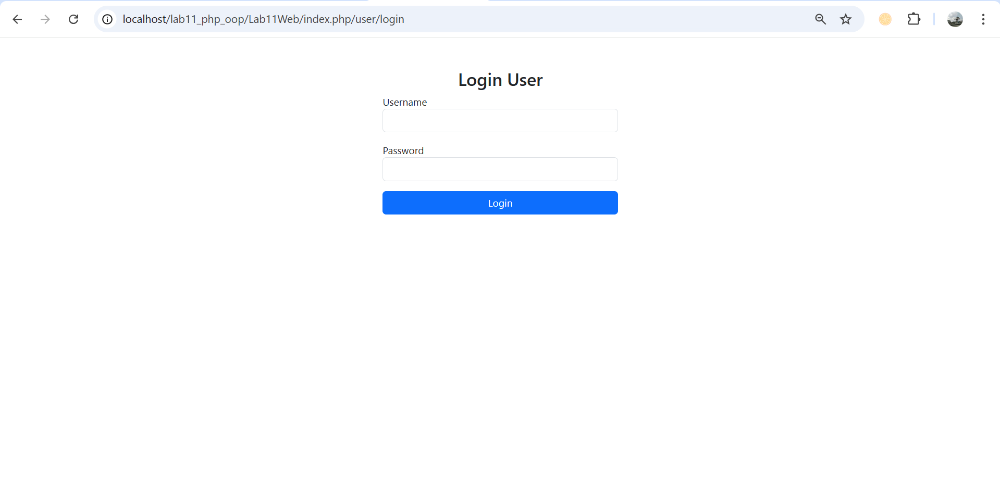
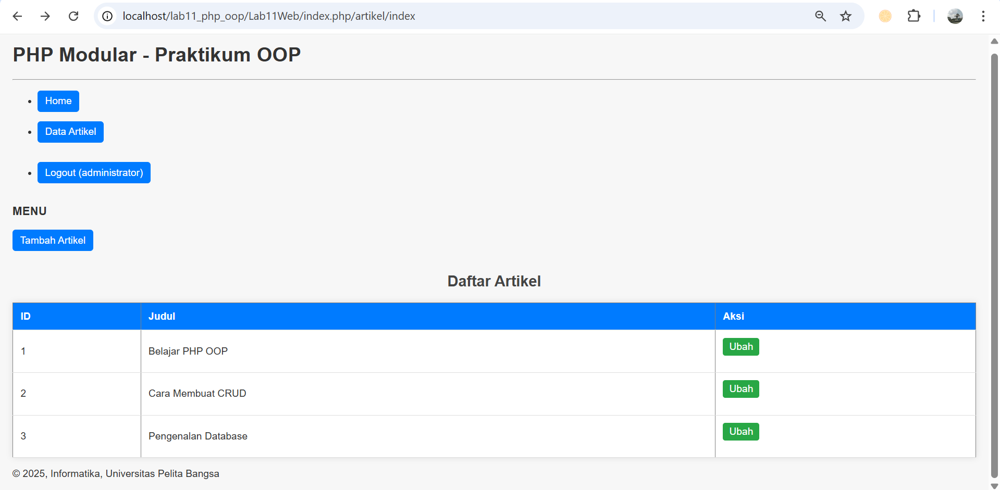
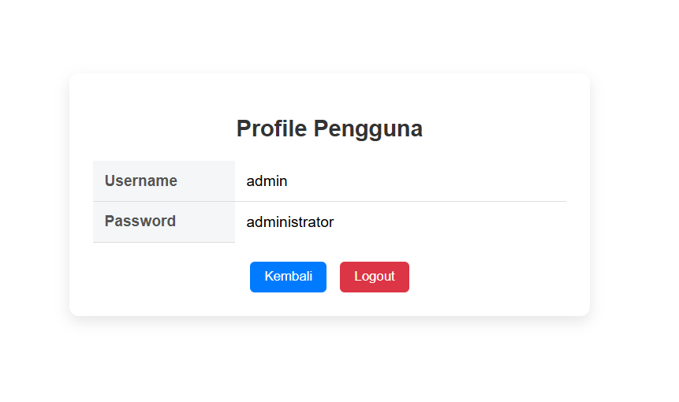
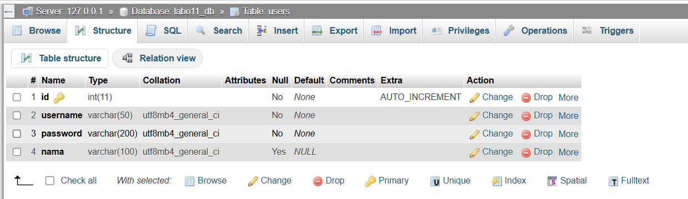

# Lab11Web

## Nama: Bagus aditya hermawan
## Nim: 312410382
## Kelas: TI.24.A.3
## Mata Kuliah: Pemrograman Web 1

## Langkah-langkah Praktikum Pertemuan 13

## A.Memepersiapkan struktur folder
###### 

Langkah 1: Pindahkan file Database.php dan Form.php (dari praktikum sebelumnya) ke
dalam folder class/.
###### 

File: database.php
###### 

## B. Konfigurasi Dasar
File: config.php Sesuaikan dengan database anda.
###### 

## Tugas & Implementasi
Implementasikan konsep modularisasi dari praktikum sebelumnya dan terapkan konsep
routing pada project yang baru.
Contoh Implementasi (Gabungan Form dan Simpan Data)
###### 

Contoh Routing:
File: .htaccess File ini penting agar URL localhost/lab11/artikel/index bisa dibaca oleh
server. Buat file baru bernama .htaccess (tanpa nama depan, hanya ekstensi).
###### 

File: index.php
###### 

## Tugas XAMPP

file .htaccess.
###### 

file config.php.
###### 

file index.php.
###### 

### folder class
file Database.php.
###### 

file Form.php.
###### 

### folder module/artikel
file index.php.
###### 

file tambah.php.
###### 

file ubah.php.
###### 

### folder template.
file header.php.
###### 

file footer.php.
###### 

file sidebar.php.
###### 

Output
###### 
###### 
###### 

### Langkah-Langkah Praktikum Pertemuan 14
A. Persiapan Database
Membutuhkan tabel untuk menyimpan data pengguna (admin).

1. Buat Tabel users
Jalankan SQL berikut di phpMyAdmin pada database latihan_oop:
###### 

2. Insert Data Dummy (User Admin)
Password harus di-hash (dienkripsi).
###### 

B. Update Routing (index.php)
Kita perlu memodifikasi index.php agar mengecek apakah user sudah login atau belum
sebelum membuka halaman tertentu.
###### 

C. Membuat Modul User (Login & Logout)
Buat folder baru: module/user/.

1. File: module/user/login.php
Halaman ini berisi Form Login dan logika pemrosesan saat tombol submit ditekan.
###### 

2. File: module/user/logout.php
File untuk menghapus session.
###### 

D. Penyesuaian Tampilan (Header)
Kita perlu mengubah template/header.php agar menu navigasi berubah dinamis:
● Jika Belum Login: Tampilkan menu Home dan Login.
● Jika Sudah Login: Tampilkan menu Home, Artikel, dan Logout.
Update template/header.php:
###### 

### Tugas Praktikum 14
Login. module/user/login.php berfungsi sebagai halaman dan proses autentikasi pengguna dalam aplikasi PHP modular berbasis OOP. File ini dibuat untuk pintu masuk utama bagi user untuk mengakses sistem.
###### 

Logout berfungsi untuk mengakhiri sesi login pengguna. Ketika user memilih menu logout.
###### 

Profile berfungsi untuk menampilkan informasi akun pengguna yang sedang login. File ini terlebih dahulu melakukan pengecekan session untuk memastikan bahwa user telah login. Jika session tidak ditemukan, user akan langsung diarahkan ke halaman login. Setelah itu, profile.php mengambil data user dari tabel users berdasarkan username yang tersimpan di session, lalu menampilkannya dalam bentuk halaman profil.
###### 

Database tabel.
###### 